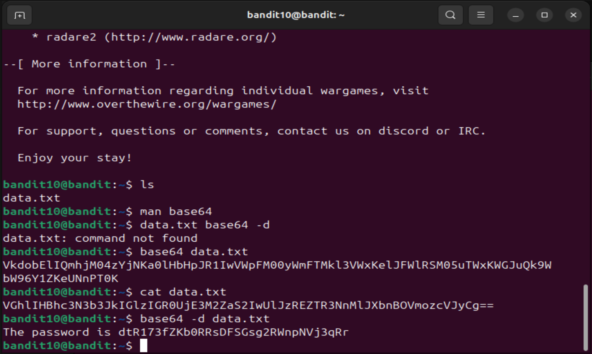

# level 10-11

This level was also direct. I just had to look at the manpage of base64 and figure out the right way to arguments (looking back at it now, I don't even know why I wrote the wrong commands).

Commands used: base64 -d data.txt

Password to login into 11: dtR173fZKb0RRsDFSGsg2RWnpNVj3qR

