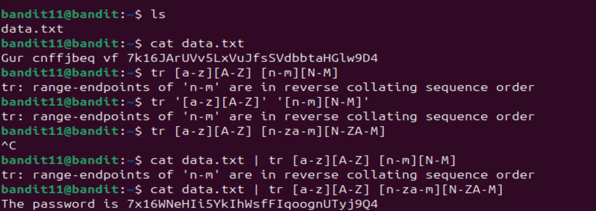

# level 11-12

Oh man, this level literally took up all of my brain cells. I had to get help from 2 seniors to get this done. I think out of all the 22 levels I've done, this might have been the longest I've ever took to complete a level. I read the manpage of tr command and thought I did everything correctly, but the logic I missed was second half of alphabets' reverse collating order. That took me time.

Commands used: cat data.txt | tr [a-z][A-Z] [n-za-m][N-ZA-M]

Password to login into level 12: 7x16WNeHIi5YkIhWsfFIqoognUTyj9Q4

