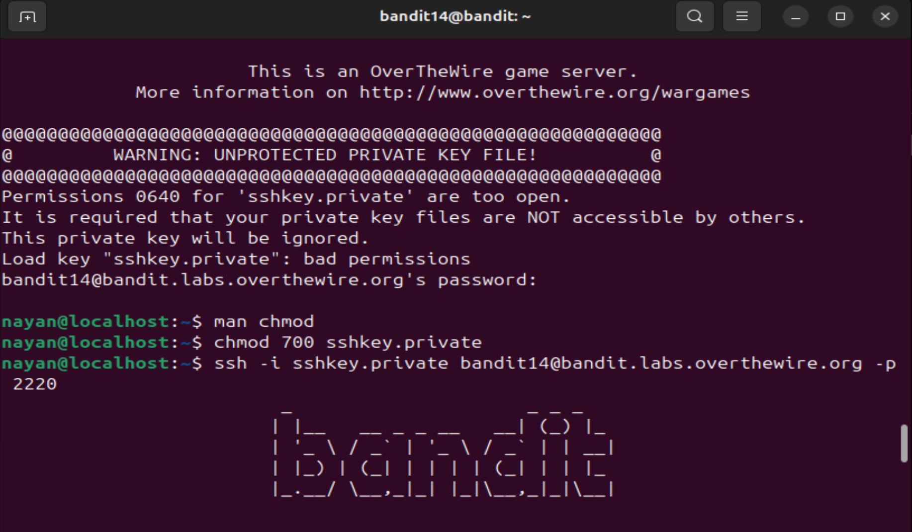
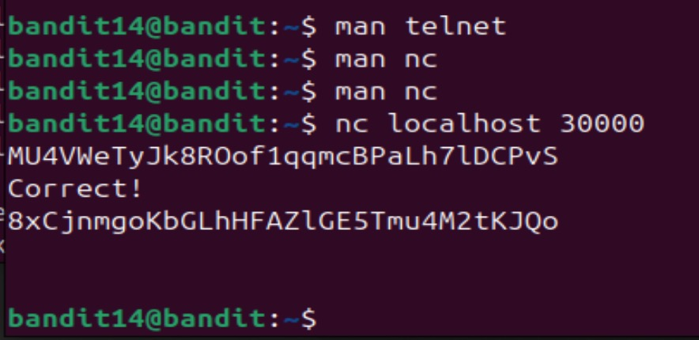

# level 14-15

1. So yet again, I was clueless as to how send inputs to a port on localhost, so I started reading the man pages of all the commands listed in "Commands you may need to solve this level". Read telnet first, then read nc and found that this was the command needed.

2. Then ran the command nc localhost 30000, sent this level's password and it returned next level's password.

Password to login into level 15: 8xCjnmgoKbGLhHFAZlGE5Tmu4M2tKJQo

 