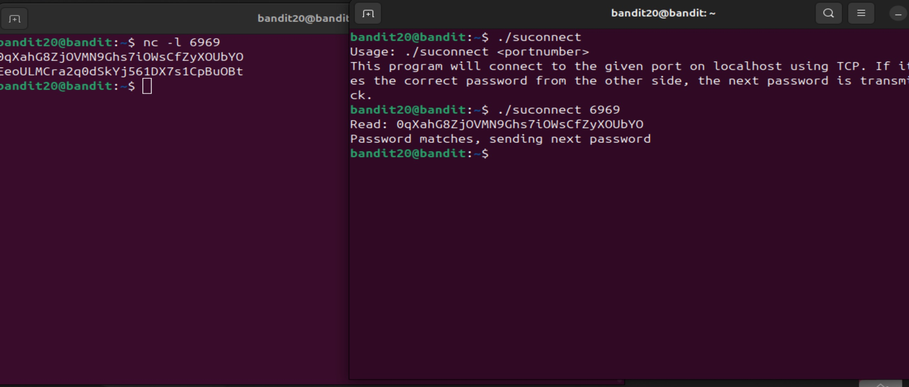

# level 20-21

1. It took me like 5 mins to understand the challenge it self, even then I wasn't sure If I got it correctly, nonetheless I decided to give it a try and to my surprise, I had understood it correctly and it worked.

2. So I had to set a port to only listen and had to connect to it from the setuid binary and match the passwords. So naturally, I looked at the man page of nc and found the arg (-l)

3. Now i ran nc -l 6969 and sent this level's password. But I didn't know how to quit or make the port stop listening, and if making it to stop listening, would not allow the setuid binary to connect to it, so I logged into bandit on another terminal window.

4. Now I used ./suconnect, and I got an error, because I forgot to mention the port number, so I ran ./suconnect 6969 and voila, it sent over the password back to port 6969.

Password to login into level 21: EeoULMCra2q0dSkYj561DX7s1CpBuOBt

